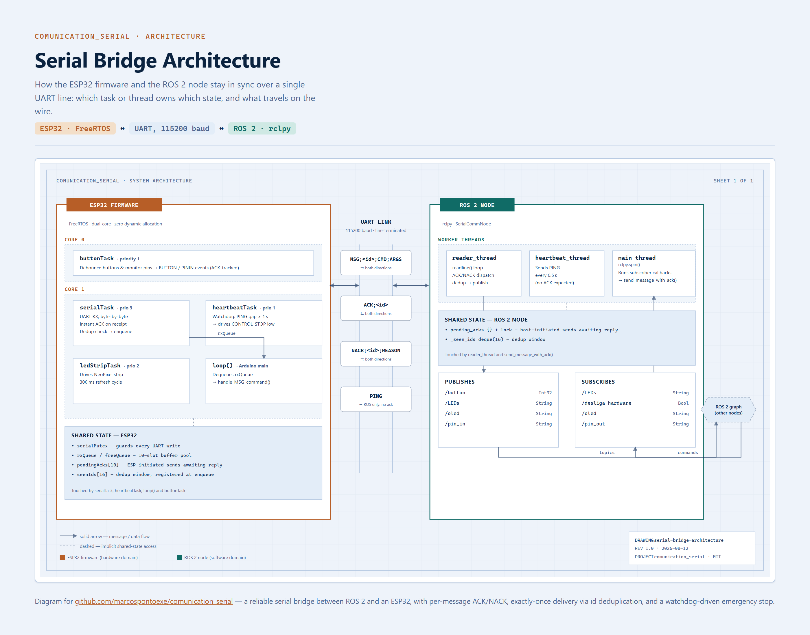
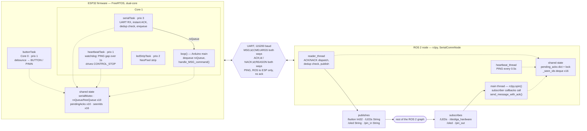

# Reliable Serial Bridge between ESP32 and ROS 2

A lightweight alternative to **micro-ROS** and **rosserial** for connecting microcontrollers to ROS 2 — with a real reliability layer (per-message ACK/NACK with ids, retransmission and timeout), a **bidirectional hardware watchdog**, and **zero dynamic allocation** in the firmware.

This is not an ad-hoc serial parser: it is a line protocol with explicit guarantees, built for a mobile robot in continuous operation, where losing a message means leaving an actuator in the wrong state.



---

## Table of contents

- [Why this project exists](#why-this-project-exists)
- [How it compares to the alternatives](#how-it-compares-to-the-alternatives)
- [What sets it apart from a plain serial parser](#what-sets-it-apart-from-a-plain-serial-parser)
- [Protocol](#protocol)
- [Architecture at a glance](#architecture-at-a-glance)
- [Firmware architecture](#firmware-architecture)
- [ROS 2 node architecture](#ros-2-node-architecture)
- [Installation and usage](#installation-and-usage)
- [Adapting it to your hardware](#adapting-it-to-your-hardware)
- [Engineering decisions](#engineering-decisions)
- [Known limitations](#known-limitations)
- [Roadmap](#roadmap)

---

## Why this project exists

The robot behind this project runs **Zenoh** (`rmw_zenoh_cpp`) as its RMW, not Fast DDS or Cyclone DDS. That fact alone ruled out the obvious answer: **micro-ROS does not support Zenoh**. Its agent-based bridge (Micro XRCE-DDS) is built and maintained around Fast DDS and, to a lesser extent, Cyclone DDS — there is no supported path to plug a micro-ROS Agent straight into a Zenoh-based graph. So before any trade-off comparison, the field was already narrowed to whatever could sit on plain serial and talk to the ROS graph through an ordinary node, which is what a bridge node in `rclpy` does regardless of which RMW it is compiled against.

More generally, when you need to connect a microcontroller to ROS 2, the usual options are:

**micro-ROS** is the official and most complete solution: the MCU becomes a real ROS 2 node, with standard message types and QoS. The cost is the stack: the firmware embeds a **Micro XRCE-DDS** client, and you must keep a separate process — the **micro-ROS Agent** — running on the computer to bridge into the ROS 2 graph. On flash-constrained MCUs (a 2 MB ESP32, for instance) that weighs, and the Agent is one more piece to start, monitor and restart in the system lifecycle.

**rosserial** solved this problem on ROS 1, but was never officially ported to ROS 2.

**Firmata / Telemetrix** turn the MCU into an I/O slave driven by the PC. Simple, but the model is *polling*: the PC asks for the pin state and waits for the answer, adding the round-trip time to every read. And the protocol is generic (MIDI-derived), spending several header and metadata bytes to read a single pin. Unusable for anything with timing requirements.

**MQTT** is great for fleets and telemetry, but requires a broker on the network and adds latency — it is not for control.

This project is the fourth option — a **custom serial bridge** — taken seriously. The fair criticism of that approach is that "you have to write and maintain the parser on both sides". This repository's answer is that the parser is already written, proven in operation, and ships with the parts a home-grown bridge usually lacks: per-message acknowledgement, retransmission, a watchdog, and concurrency safety.

## How it compares to the alternatives

| | **This bridge** | micro-ROS | Firmata / Telemetrix | MQTT + bridge |
| --- | --- | --- | --- | --- |
| Extra process on the host | **no** | yes (Agent) | no | yes (broker) |
| Native ROS message types on the MCU | no | **yes** | no | no |
| End-to-end negotiated QoS | no | **yes** | no | no |
| Per-message acknowledgement (ACK/NACK) | **yes** | yes (via DDS) | no | via broker QoS |
| Hardware watchdog / fail-safe | **yes** | no (you implement it) | no | no |
| Dynamic allocation on the MCU | **none** | yes | yes | yes |
| Input reading model | **event-driven** | event-driven | *polling* | event-driven |
| Debounce/filtering on the MCU | **yes** | up to the user | no (on the PC) | up to the user |
| Runs on flash-constrained MCUs | **yes** | limited | yes | depends |
| Debuggable with a serial monitor | **yes** (human-readable text) | no (binary) | no | no |

**On middleware:** the bridge node is an ordinary ROS 2 node written in `rclpy`. It inherits the system's `RMW_IMPLEMENTATION` — Fast DDS, Cyclone DDS or **Zenoh** (`rmw_zenoh_cpp`) — with no extra configuration and without the firmware ever knowing about it. That is the same property the micro-ROS Agent provides, minus the intermediate process.

**Where the other options win:** if you need standard ROS message types generated on the MCU itself, end-to-end negotiated QoS, or several MCUs announcing themselves dynamically on the network, **use micro-ROS** — that is what it exists for, *provided your graph runs on Fast DDS or Cyclone DDS*. If your RMW is Zenoh, that option is off the table today; **zenoh-pico** is the closer architectural match if you can take on a more involved MCU setup, since it drops the Agent entirely. This project fills a specific niche: **a point-to-point serial link, with a safety requirement and a minimal footprint**, that does not care which RMW sits behind the bridge node.

> ⚠️ **No published benchmarks.** The differences above are structural (number of processes, protocol layers, reading model), not measurements. I have not run a latency comparison against micro-ROS. If you measure one, open an issue — it is the most useful contribution this repository can receive.

## What sets it apart from a plain serial parser

**1. Bidirectional watchdog with a hardware fail-safe.**
The ROS node sends `PING` every 500 ms. If the firmware goes 1000 ms without one, it drives the `CONTROL_STOP` output — the motor driver's emergency stop. Cable yanked out, node hung, kernel panic on the PC: the robot stops on its own, depending on nothing from the host side. That guarantee lives in the firmware, not in software.

**2. Per-message reliability, in both directions.**
Every message carries an incrementing id. The sender registers the id and blocks until the reply arrives, with a timeout and up to 3 retransmissions. Both sides implement this — the ESP32 with FreeRTOS binary semaphores (the task sleeps, it does not busy-wait), Python with `threading.Event`. If there is no resource to process the message, the answer is an explicit `NACK;<id>;REASON` instead of silence.

**ACK and NACK are handled differently, on both sides.** The wait primitive carries the *status* of the reply, not merely the fact that one arrived: a NACK wakes the waiter and returns failure, rather than being mistaken for successful delivery. And a NACK does **not** trigger retransmission — the cause is a lack of resources on the other side (`NO_BUFFER`, `QUEUE_FULL`), not a loss on the link, so resending immediately tends to be refused again. Timeout retransmits; an explicit rejection does not.

**Exactly-once delivery, also on both sides.** A retransmission resends the identical line, with the same id — that id is what makes it recognisable. Each receiver keeps a window of the last 16 processed ids: when it recognises a retransmission it **re-acknowledges it** (that ACK is precisely what got lost) but **does not execute it again**.

Without this, an ACK lost on the return path would make the command run twice. And in the MCU → ROS direction the effect would be worse: a single button press would reach ROS as two events on `/button`. This is the kind of failure that shows up once a week, disappears when you go looking for it, and gets blamed on "cable noise".

**3. Zero dynamic allocation in the firmware.**
No `malloc`, no Arduino `String`, no `new` on the data path. Incoming lines go into a **fixed pool of 10 buffers of 256 bytes**, managed by two FreeRTOS queues (`freeQueue` and `rxQueue`). With no heap on the hot path there is no fragmentation — which matters when the target is running for weeks without a restart.

**4. Atomic serial writes across cores.**
The tasks run pinned to **different cores** of the ESP32 — these are genuinely parallel UART writes, not merely interleaved by the scheduler. A line assembled from several `Serial.print` calls can be split in half by another task's output, and the host receives `ACK;PININ;IN_2;high` followed by a stray number: the ACK **and** the event are both lost at once.

Every write goes through `serialSendLine()`/`serialSendLinef()`, protected by a FreeRTOS mutex. **A mutex and not a binary semaphore**, because of priority inheritance: `serialTask` runs at priority 3, and when it blocks on a mutex held by a priority-1 task, that task is temporarily promoted and releases quickly. A binary semaphore would allow priority inversion.

This is a subtle bug that appears intermittently and is easy to blame on the cable. It is fixed here.

**5. Processing on the MCU, not on the PC.**
The 50 ms debounce happens in the firmware. The ESP32 only speaks once it is sure the pin actually changed state — instead of dumping dozens of noise transitions onto the bus for the PC to filter. Inputs are event-driven: the moment a pin changes, the firmware pushes the message. No request/response round-trip.

**6. Debuggable with a serial monitor.**
The protocol is text. You can open the Arduino Serial Monitor, type `MSG;1;DISPLAY;Line 1;Line 2` and watch the hardware respond — with no ROS running, no agent, no binary decoder. That changes how long field diagnosis takes.

## Protocol

One message per line, terminated by `\n`, fields separated by `;`:

```
MSG;<id>;<COMMAND>;<ARGS...>
ACK;<id>
NACK;<id>;<REASON>
PING
```

The `<id>` is an incrementing counter kept **independently on each side**: each end only tracks the ids it generated itself.

### ROS → ESP32

| Message | Effect |
| --- | --- |
| `PING` | Heartbeat. Feeds the watchdog. Produces no ACK. |
| `MSG;<id>;LED;<color>` | WS2812B strip colour. `Branco`, `Laranja`, `Amarelo`, `Azul`, `Verde`, `Roxo`, `Ciano`, `Vermelho` (white, orange, yellow, blue, green, purple, cyan, red); any other value turns the strip off. |
| `MSG;<id>;DISPLAY;<line1>;<line2>` | Two centred lines on the SSD1306 OLED. |
| `MSG;<id>;PINOUT;<idx>;<high\|low>` | Writes an output GPIO. `<idx>` is an index into `PINS_OUT[]`, **not** the GPIO number. |
| `MSG;<id>;POWER_OFF` | Safe shutdown: countdown on the display, then the main switch is cut. |

### ESP32 → ROS

| Message | Effect |
| --- | --- |
| `MSG;<id>;BUTTON;<n>` | Button pressed (falling edge, debounced). `<n>` is an index into `BUTTON_PINS[]`. |
| `MSG;<id>;PININ;<pin_name>;<high\|low>` | A monitored pin changed state, in either direction. `<pin_name>` is the `#define` name, resolved at compile time. Also sent at boot with the initial state — the ROS side never has to assume one. |

### Diagnostics

Non-protocol lines, recorded as logs by the node:

| Line | Meaning |
| --- | --- |
| `EXEC_OK:<CMD>:<args>` | Command executed. |
| `EXEC_FAIL:UNKNOWN_CMD:<cmd>` | Unrecognised command. |
| `EXEC_FAIL:PINOUT_FORMAT` / `PINOUT_RANGE` | Malformed `PINOUT`, or index out of range. |
| `DUP:<id>` | Retransmission recognised: re-acknowledged, but not executed again. |
| `NACK;<id>;NO_BUFFER` / `QUEUE_FULL` | No free buffer / queue full: message dropped. |
| `ERROR:LINEBUF_OVERFLOW` | Line longer than 255 bytes; dropped. |

### Timing parameters

| Parameter | Value | Constant |
| --- | --- | --- |
| Interval between PINGs | 0.5 s | `HEARTBEAT_INTERVAL` (Python) |
| Watchdog timeout → emergency stop | 1000 ms | `HEARTBEAT_TIMEOUT_MS` (ESP) |
| ACK timeout | 1.0 s | `ACK_TIMEOUT` / `timeout_ms` |
| Retransmissions | 3 | `DEFAULT_RETRIES` / `retries` |
| Debounce | 50 ms | `DEBOUNCE_DELAY_MS` |

The margin between the PING and the timeout is **one cycle**: two consecutive lost PINGs trigger the stop. Tighten or loosen it according to your risk profile.

## Architecture at a glance

Which task or thread owns which piece of state, and what actually travels on the wire:



Solid arrows are direct calls or message flow; dotted arrows mean "reads or writes this shared state". The two dedup windows (`seenIds` on the firmware, `_seen_ids` on the node) are what make a retransmitted message safe to re-acknowledge without re-executing it — see [exactly-once delivery](#what-sets-it-apart-from-a-plain-serial-parser) above.

## Firmware architecture

Five execution contexts, explicitly pinned to cores ([esp32.ino](./esp32/esp32.ino)):

| Task | Core | Prio | Stack | Role |
| --- | --- | --- | --- | --- |
| `serialTask` | 1 | 3 | 4096 | Reads the UART byte by byte, replies with ACK and enqueues into `rxQueue`. The only producer for that queue. |
| `ledStripTask` | 1 | 2 | 1536 | Drives the LED strip from a state variable. |
| `heartbeatTask` | 1 | 1 | 4096 | Watches `last_ping_ms` and trips the emergency stop. |
| `loop()` | 1 | 1 | — | Consumes `rxQueue` and executes the commands. |
| `buttonTask` | 0 | 1 | 3072 | Polls buttons and monitored pins with a 50 ms debounce. |

> In the ESP-IDF FreeRTOS port (used by the Arduino-ESP32 core) the stack parameter and the return value of `uxTaskGetStackHighWaterMark()` are in **bytes**, not in words as in vanilla FreeRTOS.

Splitting `serialTask` (which only receives and enqueues) from `loop()` (which executes) is deliberate: the ACK goes out in microseconds regardless of whether the command takes 30 seconds to run — as `POWER_OFF` does, with its countdown. `loop()` prints every task's stack high water mark every 5 s, so stack sizing is verifiable rather than guessed.

## ROS 2 node architecture

Three contexts in [communicator_serial.py](./comunication_serial/comunication_serial/communicator_serial.py):

1. **Main executor** — handles the topic callbacks; each one calls `send_message_with_ack()`, which blocks until the reply or the timeout.
2. **`_reader_thread`** — blocking `readline()`; dispatches ACK/NACK to the pending entries and publishes MCU events onto the topics.
3. **`_heartbeat_thread`** — `PING` every 500 ms.

### Topics

**Subscribed (ROS → ESP)**

| Topic | Type | QoS | Command |
| --- | --- | --- | --- |
| `/LEDs` | `String` | transient_local | `LED;<color>` |
| `/oled` | `String` | transient_local | `DISPLAY;<l1>;<l2>` |
| `/pin_out` | `String` | volatile | `PINOUT;<idx>;<state>` — payload `"0;high"` |
| `/desliga_hardware` | `Bool` | volatile | `POWER_OFF` |

**Published (ESP → ROS)**

| Topic | Type | QoS | Source |
| --- | --- | --- | --- |
| `/button` | `Int32` | transient_local | `BUTTON` event |
| `/pin_in` | `String` | transient_local | `PININ` event — payload `"IN_2;high"` |

`TRANSIENT_LOCAL` on the state topics is a deliberate choice: a node that starts later immediately receives the last known pin state without having to ask. `VOLATILE` on the one-shot commands, where redelivering a stale order would be wrong.

## Installation and usage

### Firmware

Arduino IDE with ESP32 board support (`https://dl.espressif.com/dl/package_esp32_index.json`), board **ESP32 Dev Module**. Libraries: **Adafruit NeoPixel**, **Adafruit GFX**, **Adafruit SSD1306**. Flash [esp32.ino](./esp32/esp32.ino).

> On Linux, install the Arduino IDE via `apt`, not via `snap`. The snap build bundles a Python older than 3.7 and the upload fails in `flasher.py` with `SyntaxError: future feature annotations is not defined`. Compilation works; only flashing breaks.

### ROS 2 node

```bash
cd ~/ros2_ws/src
cp -r /path/to/comunication_serial .
cd ~/ros2_ws
rosdep install --from-paths src --ignore-src -r -y
colcon build --packages-select comunication_serial
source install/setup.bash
```

No external dependencies beyond `rclpy`, `std_msgs` and `pyserial` — all resolved by `rosdep`.

The node will not start yet: it opens `/dev/ESP`, which has to be created first (next section). With the symlink in place:

```bash
ros2 launch comunication_serial communicator_serial.launch.py
```

### Fixed serial port: the `/dev/ESP` symlink

The node opens the port defined in `PORT`, which defaults to **`/dev/ESP`** — and that device **does not exist until you create it**. This is a required step on Ubuntu.

The reason is that Linux names USB-serial adapters in enumeration order: the ESP32 shows up as `/dev/ttyUSB0` today and `/dev/ttyUSB1` tomorrow, depending on what else was connected at boot. On a robot that also has a lidar, an IMU and a motor driver on the USB bus, pointing the node at `/dev/ttyUSB0` guarantees that sooner or later it will open the wrong device. A udev rule creates a stable name that always points at the right board.

**1. Identify your board's USB-serial adapter**

With the ESP32 connected, see which device appeared:

```bash
ls -l /dev/ttyUSB* /dev/ttyACM*
```

Now read its attributes (replace `ttyUSB0` with whatever showed up):

```bash
udevadm info -a -n /dev/ttyUSB0 | grep -E 'idVendor|idProduct|\{serial\}' | head -n 5
```

Typical output:

```
    ATTRS{idVendor}=="10c4"
    ATTRS{idProduct}=="ea60"
    ATTRS{serial}=="0001"
```

Those are **your** board's values — note the first two down. The most common chips on ESP32 boards:

| Chip | idVendor | idProduct |
| --- | --- | --- |
| CP2102 / CP2104 (Silicon Labs) | `10c4` | `ea60` |
| CH340 / CH341 (WCH) | `1a86` | `7523` |
| CH9102 (WCH) | `1a86` | `55d4` |
| FT232R (FTDI) | `0403` | `6001` |

**2. Create the udev rule**

```bash
sudo nano /etc/udev/rules.d/99-esp.rules
```

Write a single line, using the values you noted:

```
SUBSYSTEM=="tty", ATTRS{idVendor}=="10c4", ATTRS{idProduct}=="ea60", SYMLINK+="ESP", GROUP="dialout", MODE="0660"
```

**3. Reload the rules and reconnect the board**

```bash
sudo udevadm control --reload-rules
sudo udevadm trigger
```

Unplug and replug the USB cable — the symlink is only created when udev processes a new connection event.

**4. Verify**

```bash
ls -l /dev/ESP
```

You should see something like:

```
lrwxrwxrwx 1 root root 7 Oct 14 09:12 /dev/ESP -> ttyUSB0
```

**5. Grant your user access**

The rule above hands the device to the `dialout` group. Add yourself to it:

```bash
sudo usermod -aG dialout $USER
```

This only takes effect in the **next session** — log out and back in, or use `newgrp dialout` in the current terminal to test right away. Confirm with `groups | grep dialout`.

> If you have **two boards with the same** USB-serial chip, `idVendor`/`idProduct` cannot tell them apart and the symlink lands on whichever enumerates first. In that case add the serial number to the rule (the `ATTRS{serial}` from step 1) and give each one a different name:
>
> ```
> SUBSYSTEM=="tty", ATTRS{idVendor}=="10c4", ATTRS{idProduct}=="ea60", ATTRS{serial}=="0001", SYMLINK+="ESP"
> ```

#### If it does not work

| Symptom | Likely cause |
| --- | --- |
| `/dev/ESP` never appears | The board was not reconnected after `udevadm control --reload-rules`. Unplug and replug the cable. |
| `Permission denied` when opening the port | You are not in the `dialout` group in this session yet. Log out and back in. |
| `Device or resource busy` | Ubuntu's **ModemManager** probes serial adapters assuming they are modems. Exclude this device by adding `ENV{ID_MM_DEVICE_IGNORE}="1"` to the rule, or remove the service with `sudo apt remove modemmanager` if you have no modem. |
| The rule seems to be ignored | Test with `udevadm test /sys/class/tty/ttyUSB0` and check whether `SYMLINK` is applied. Syntax errors (quotes, `==` vs `=`) make udev discard the whole line silently. |

Would rather not use udev? Just change `PORT` at the top of [communicator_serial.py](./comunication_serial/comunication_serial/communicator_serial.py) to the direct path, aware that it may change between boots:

```python
PORT = "/dev/ttyUSB0"
```

### Passwordless `shutdown` for the power button

Button 0 is the hardware power button. When it is pressed, the firmware sends
`BUTTON;0` and the node shuts the host computer down before the ESP32 cuts the
power rail — so the filesystem is unmounted cleanly instead of losing power
mid-write. That is done in [communicator_serial.py](./comunication_serial/comunication_serial/communicator_serial.py)
with:

```python
os.system('sudo shutdown now')
```

The node runs without a terminal, so `sudo` has nowhere to ask for a password.
**Without the configuration below the command fails silently**: the LED strip goes
dark and the OLED shows "Shutting down..", the ESP32 counts down and cuts power
30 s later — but the computer was never asked to shut down, and it loses power
while still running.

Grant passwordless sudo for **that one command only** — never a blanket rule:

```bash
sudo visudo -f /etc/sudoers.d/ros-shutdown
```

Add a single line, replacing `ubuntu` with the user that runs the node:

```
ubuntu ALL=(root) NOPASSWD: /sbin/shutdown
```

Then fix the permissions and confirm the file parses — a broken sudoers file
locks you out of `sudo` entirely, which is why `visudo` is used instead of a
plain editor:

```bash
sudo chmod 0440 /etc/sudoers.d/ros-shutdown
sudo visudo -c
```

Verify as the node's user. It must print the shutdown schedule without prompting:

```bash
sudo -n shutdown --help
```

If it prints `sudo: a password is required`, the rule is not being matched. Check
that the path is right for your system — `which shutdown` may report
`/usr/sbin/shutdown`, and the path in the rule has to match exactly.

> **Do not use `NOPASSWD: ALL`.** It would let anything running as that user gain
> root, and the node's own attack surface includes a serial line: a `BUTTON;0`
> frame is trusted purely because it arrived on the wire.

**Prefer not to give the node this power?** Delete the `os.system` call — the
`BUTTON;0` event is still published, so you can react to it in a dedicated node
of your own with whatever privileges you consider appropriate.

### Logging

The node uses the `rclpy` logger, so its output shows up on the console and on `/rosout` like any other node — `ros2 topic echo /rosout` and the standard tooling work with no configuration.

The level is controlled by a single constant at the top of the file:

```python
LOG_LEVEL = LogsLevel.info   # debug | info | warning | error | fatal
```

It also adjusts the node logger's severity, so raising it to `LogsLevel.debug` starts showing every ACK exchange — which is the way to diagnose communication problems.

To keep history on disk, set `LOG_FILE`; a stdlib `RotatingFileHandler` then receives the same messages, without replacing the ROS logger:

```python
LOG_FILE = "/var/log/serial_comm_node.log"   # None disables it
```

### Quick test, without ROS

Open the Serial Monitor at 115200 with "New line" endings and send:

```
MSG;1;DISPLAY;Hello;ROS 2
MSG;2;LED;Verde
MSG;3;PINOUT;0;high
```

The firmware replies `ACK;1`, `EXEC_OK:DISPLAY:Hello;ROS 2` and so on. Note that without the `PING`s the watchdog trips the emergency stop after 1 second — that is the expected behaviour.

### Running the tests

The protocol guarantees claimed above are covered by a test suite that needs **no hardware and no ROS installation** — missing modules are stubbed, so it also runs in a bare CI container:

```bash
cd comunication_serial
pytest test/test_protocol.py -v
```

Nine cases exercise the real `send_message_with_ack()` and `_reader_thread_fn()`:

| Test | What it pins down |
| --- | --- |
| `test_ack_returns_true_after_a_single_transmission` | The happy path does not retransmit. |
| `test_nack_returns_false_and_is_not_retransmitted` | A NACK returns failure and returns *immediately*, without waiting out the timeout. |
| `test_timeout_exhausts_every_attempt` | Three transmissions before giving up. |
| `test_ack_on_the_last_attempt_still_succeeds` | A late ACK is still honoured. |
| `test_pending_table_is_left_clean` | No leaked entries in `pending_acks`. |
| `test_duplicate_button_is_published_once_and_acked_twice` | Exactly-once delivery: one publish, **two** ACKs. |
| `test_distinct_ids_are_both_published` | Deduplication does not swallow legitimate messages. |
| `test_duplicate_pinin_is_published_once` | Same guarantee for `PININ` events. |
| `test_id_reused_after_the_window_expires_is_treated_as_new` | The documented limit of the 16-id window. |

Under a full ROS 2 workspace they also run through `colcon test --packages-select comunication_serial`, alongside the standard `ament` lint checks.

## Adapting it to your hardware

The protocol is not coupled to this project's robot. To move it to another one:

- **Pins:** edit the `#define`s and the `PINS_OUT[]`, `BUTTON_PINS[]` and `MONITOR_PINS[]` arrays at the top of the `.ino`. `PINS_OUT_COUNT` and friends are derived with `sizeof`, so adding a pin requires no other change. The name published in `PININ` comes from the `STRINGIFY` macro applied to the `#define` itself — the pin's name in ROS follows the code automatically.
- **New commands:** add an `else if` in `handle_MSG_command()` and the matching method on the Python side. The `MSG;<id>;…` envelope and the whole ACK layer come for free.
- **Peripherals you do not use:** the LED strip and the OLED are isolated in `ledStripTask()` and `display_text()`. Removing them is a local change.

> ⚠️ **Mind the ESP32 strapping pins** if you remap. GPIO0 held low at reset drops the chip into the bootloader; GPIO12 (MTDI) held high selects 1.8 V flash and prevents boot on 3.3 V modules. Both are usable as I/O after boot, but if an external circuit holds them at the wrong level during a reset, the firmware will not come up.

## Engineering decisions

A record of the *why*, for whoever reads the code:

**Why ACK on reception rather than on execution.** `serialTask` replies as soon as it recognises the line format, before enqueuing. That keeps acknowledgement latency constant and decoupled from how long the command takes to run. The cost is explicit and documented under [limitations](#known-limitations): an ACK means "line received", not "command executed".

**Why a fixed pool instead of the heap.** The target is weeks of continuous operation. Heap fragmentation on an MCU is a failure mode that surfaces after days — precisely the worst moment.

**Why text and not binary.** A binary protocol would be more compact. Debuggability with a serial monitor won: for this system's message volume (discrete events, not sensor streaming), bandwidth was never the bottleneck. For high-rate telemetry the choice would be different.

**Why a mutex and not a binary semaphore on the serial.** Priority inheritance — explained [above](#what-sets-it-apart-from-a-plain-serial-parser).

**Why no `Serial` inside an ISR.** A FreeRTOS mutex cannot be taken from an interrupt (there is no `xSemaphoreTakeFromISR` for mutexes, precisely because of priority inheritance). The pattern adopted is to raise a flag in the ISR and let the corresponding task emit the line.

**Why validate input coming from a ROS topic.** `/pin_out` is an ordinary topic: any process can publish to it, including a `ros2 topic pub` during debugging. Before the guards were added, a payload without a `;` crashed the microcontroller through an invalid memory access — and on reboot the relays pulsed. External input is external input, even when it comes from "inside" the system.

## Known limitations

Documented out of honesty, and because they are good starting points for contributing:

| Limitation | Effect |
| --- | --- |
| **An ACK does not mean execution** | `serialTask` acknowledges before enqueuing. If the pool is full, a `NACK;<id>;NO_BUFFER` follows — but the ACK is already out. |
| **No ROS message types on the MCU** | The firmware knows nothing about `std_msgs`. All translation happens in the bridge node. |
| **No end-to-end QoS** | QoS applies from the bridge node into the ROS graph. On the serial link, the guarantee is this protocol's ACK/retry. |
| **One MCU per node** | The protocol is point-to-point. Multiple MCUs require one node instance each. |

## Roadmap

- [ ] Expose port, baud rate and timeouts through `ros2 param` instead of module constants
- [ ] Latency and jitter benchmark against micro-ROS and Firmata, on the same hardware
- [ ] Integration tests against an emulated ESP32

---

Contributions are welcome — measurements especially. If you run this protocol on different hardware, open an issue and say so: a body of real-world cases is what validates a project like this.
